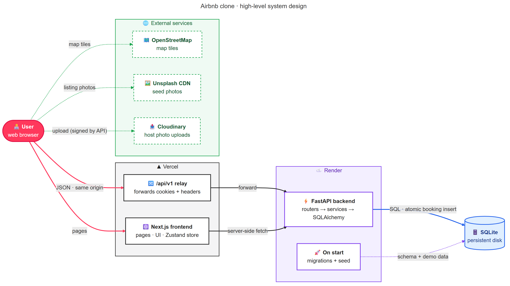
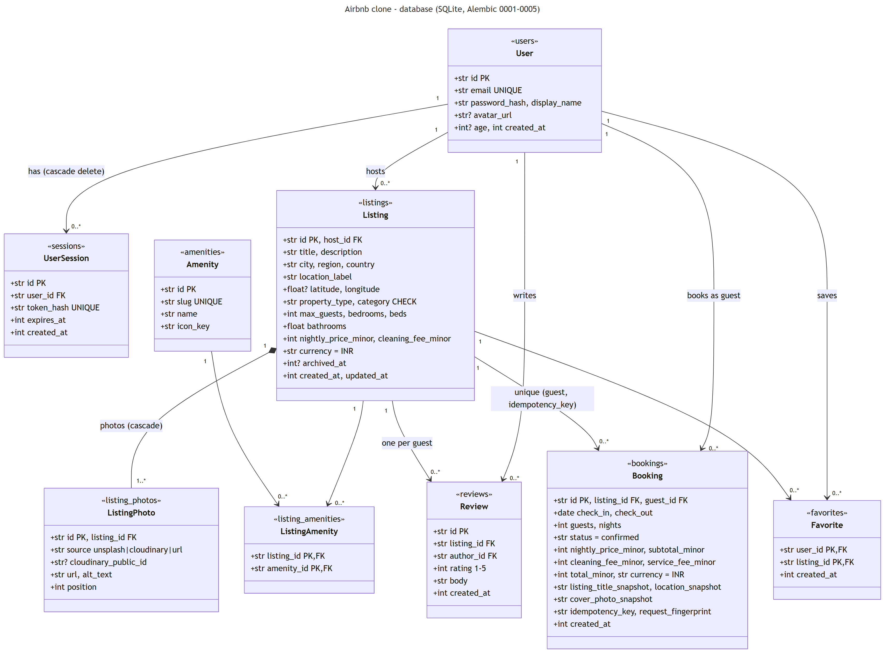

# Airbnb stays marketplace

A clone of Airbnb's stays marketplace: browse and search homes, view a listing, book it, see your trips, save favourites, and host your own listings.

- **Frontend:** Next.js 16 (App Router, TypeScript), Tailwind 4, shadcn/Radix, Zustand
- **Backend:** FastAPI, SQLAlchemy 2, Alembic, pytest
- **Database:** SQLite (a file locally; a file on a persistent disk in production)
- **Live:** frontend https://airbnb-v1.vercel.app, API https://airbnb-v1.onrender.com/docs

## Features

- **Explore:** category shelves on the home page, and search by location, dates and guests.
  - Filters (price range, property type, category, amenities; all must match) and 12 results per page.
  - A map of results (Leaflet + OpenStreetMap).
- **Listing page:** photo gallery, amenities, host card, reviews with a rating breakdown, an availability calendar and a live price breakdown.
- **Booking:** review the stay, then confirm. No payment is taken.
  - Prices are recomputed on the server, and if the price changed the new total is shown.
  - A retry never creates a second booking.
- **Profile:** About, Trips (upcoming and past, with "Leave a review" after a stay), Wishlists (hearts stay in sync everywhere) and Hosting.
- **Hosting:** create, edit and archive listings with photo URLs or Cloudinary uploads, plus a reservations list.
- **Auth:** sign up or log in with email and password; the session lives in an HttpOnly cookie.
- **Light and dark themes.** Experiences, Services, messaging and similar features show "Coming soon".

## Run locally

Needs Node.js 20.9+ with npm, and Python 3.14+ with [uv](https://docs.astral.sh/uv/). No accounts or API keys are needed.

```bash
git clone https://github.com/mehul79/airbnb_v1.git
cd airbnb_v1
```

**Terminal 1, backend:**

```bash
cd backend
uv sync --locked
cp .env.example .env              # PowerShell: Copy-Item .env.example .env
uv run alembic upgrade head       # create the tables in backend/dev.db
uv run python -m app.seed         # demo data; safe to re-run
uv run uvicorn app.main:app --reload --port 8000
```

**Terminal 2, frontend:**

```bash
cd frontend
npm ci
cp .env.example .env.local        # PowerShell: Copy-Item .env.example .env.local
npm run dev
```

Open http://localhost:3000. The API docs are at http://localhost:8000/docs.


## Demo accounts

All use the password `demo-password`.

| Email | Role in the seed |
|---|---|
| `meera.kapoor@example.com` | Host; has the Superhost and Guest favourite badges |
| `arjun.nair@example.com` | Host |
| `kavya.rao@example.com` | Host |
| `rohan.verma@example.com` | Guest; use this one to try booking |
| `ananya.iyer@example.com` | Guest |

The seed holds:
- 40 listings across Goa, Himachal Pradesh, Rajasthan and Kerala (10 each)
- 126 Unsplash photos and 12 amenities
- 72 reviews
- 22 past and upcoming bookings

Some listings have no reviews and show "New". Every account can both book and host.

## Architecture




## Database schema



## API

All routes are under `/api/v1`. Full request and response shapes are at `/docs`.

| Area | Endpoints |
|---|---|
| Auth | `POST /auth/check`, `/auth/signup`, `/auth/signin`, `/auth/signout`; `GET /me`, `PATCH /me` |
| Listings | `GET /listings` (search, filters, pages), `GET /listings/map`, `GET /listings/{id}`, `GET /listings/{id}/reviews`, `POST /listings/{id}/reviews`, `GET /listings/{id}/availability`, `POST /listings/{id}/quote`, `GET /amenities` |
| Bookings | `POST /bookings` (needs an `Idempotency-Key` header), `GET /bookings/{id}`, `GET /me/bookings` |
| Favourites | `GET /me/favorites`, `GET /me/favorites/ids`, `PUT /me/favorites/{id}`, `DELETE /me/favorites/{id}` |
| Hosting | `GET /host/listings`, `POST /host/listings`, `GET`/`PATCH`/`DELETE /host/listings/{id}`, `GET /host/bookings`, `POST /host/uploads/sign` |
| Health | `GET /health` |

## How booking stays correct

1. Read-only checks give a precise error: the dates are valid, the guest count fits, the listing isn't yours, and the quoted price is still current.
2. The booking is then written by one atomic statement: `INSERT INTO bookings ... SELECT ... WHERE listing active AND price unchanged AND NOT EXISTS (overlapping booking)`. Two requests for the same nights can't both succeed, and no lock is held.
3. A unique `(guest, Idempotency-Key)` makes a retried request return the same booking instead of a second one.


## Assumptions

- **Dates:**
  - A stay occupies `[check_in, check_out)`, so a guest can arrive on the previous guest's checkout day.
  - "Today" is Asia/Kolkata, and check-in today is allowed.
- **Prices:**
  - service fee = 10% of the subtotal, rounded half up
  - total = subtotal + cleaning fee + service fee
  - A quote is not a hold.
- **Accounts:** a single account type. Hosting is a view switch, not a role. Auth is deliberately simple: no OAuth, email verification, password reset or rate limiting.
- **Listings:** deleting a listing archives it, so past bookings stay readable.
- **Badges:**
  - Guest favourite: rating 4.8+ with 3+ reviews.
  - Superhost: 4.8+ across 10+ reviews and 3+ completed stays.
- **Not built:** payments, cancellations and messaging.
